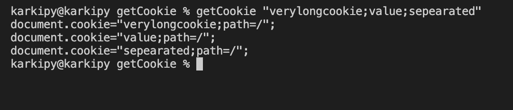

## Installation


```bash
sudo curl https://raw.githubusercontent.com/karkipy/bash-zero/master/node/getCookie/getCookie -o /usr/local/bin/getCookie && sudo chmod +x /usr/local/bin/getCookie
```

## EXAMPLE

```bash

getCookie  someCookie
```

## Output

```bash
document.cookie="sd;path=/";
```


