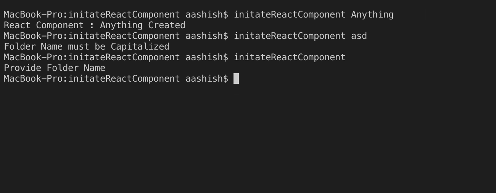
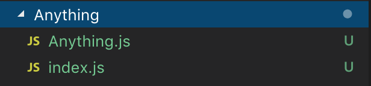

## Requirement

 - Python

## Installation
```bash
sudo curl https://github.com/karkipy/bash-zero/blob/master/python/initateReactComponent/initateReactComponent -o /usr/local/bin/initateReactComponent && sudo chmod +x /usr/local/bin/initateReactComponent
```

## Purpose

This command creates a folder with initated react component with same name as foldername passed in the argument


## Command

```bash

initateReactComponent FolderName
```
FolderName should be capitalized

## Example

### Code



### Output


